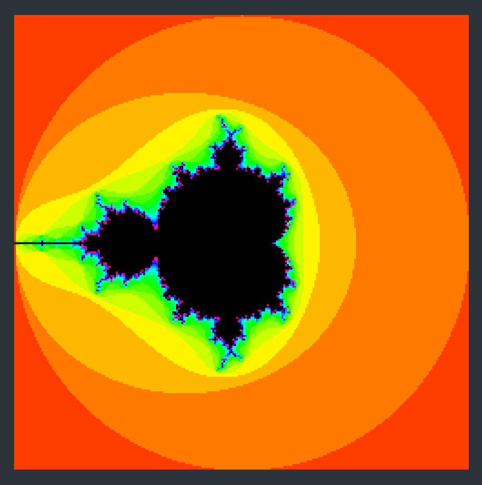

# Mandelbrot Explorer in Clojure with Seesaw

An interactive Mandelbrot Fractal explorer!
Use h/j/k/l to pan, u/i to zoom, and n/m to change the number of iterations.

## Installation

1. Install Leiningen.
2. Clone the repo.
3. `lein run`.

## Pictures!

